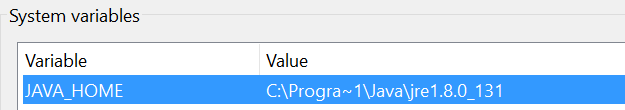
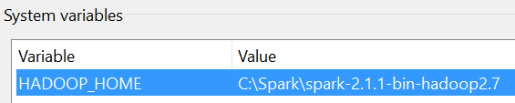
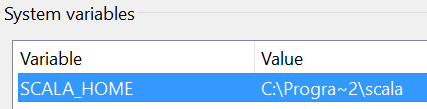
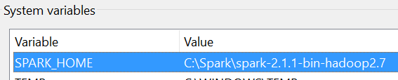
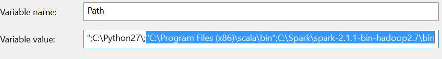
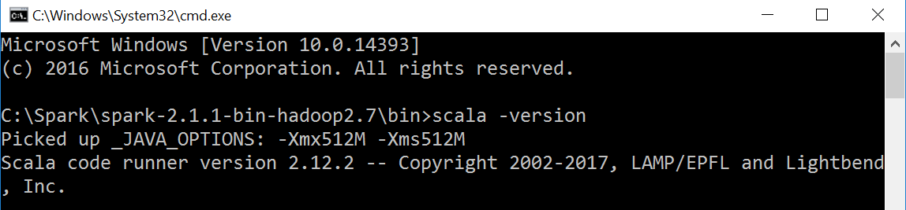
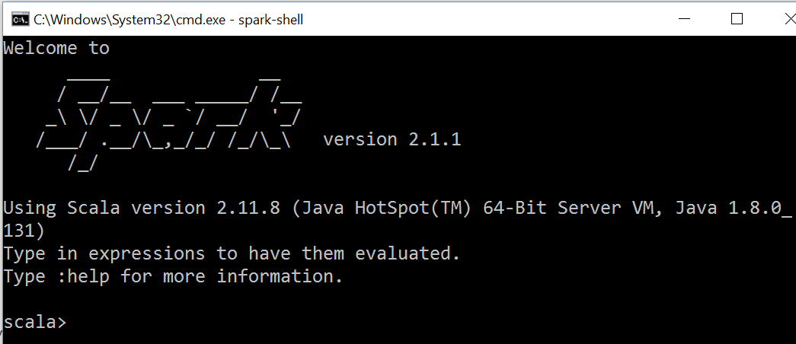

### Discovering Spark from a .NET developers perspective

#### Martin Short

---

## Why look into Spark?

TODO

---

## So, what is Spark?

TODO

---

## Getting Started

Getting Spark installed and setup (to run standalone) on Windows 10 involves a few steps and can be a little tricky, but here's how...

---

### Downloads

- **Java** - Scala 2.12+ requires Java version 8+
- **Scala** - Get the Windows (msi) installer from [http://www.scala-lang.org/download](http://www.scala-lang.org/download)
- **Spark** - Get the pre-compiled distribution (.tgz file) from [http://spark.apache.org/downloads.html](http://spark.apache.org/downloads.html)
- **winutils.exe** Get the binary from [https://github.com/steveloughran/winutils](https://github.com/steveloughran/winutils) (select the version of Hadoop that matches the pre-compiled Spark distribution that you downloaded)

---

### Installation

- **Java** - Follow instructions
- **Scala** - Run msi and follow instructions
- **Spark** - Unzip & untar the .tgz file to suitable location e.g. C:\\Spark\\
- **winutils.exe** - copy the binary to C:\\Spark\\spark-\<version\>\\bin\\

---

### Setup (System) Environment Variables

<br />


<br />


---

<br />


<br />


---

<br />


Note the use of **Progra~1** & **Progra~2** - the rendered values for these are "Program Files" "Program Files (x86)" respectively. IMPORTANT: using these will avoid a lot of pain caused by spaces in paths...due to Spark using these variables in it's own internal cmd files.

---

### Add to (System) Environment Path Variable

- Path to Scala binaries
- Path to Spark binaries

<br />


---

### Grant Permissions on tmp/hive Folder

Ensure the folder structure C:\tmp\hive exists.

Open a Windows Command Prompt (run as Administrator) and navigate to the folder that contains winutils.exe, then run:

```
winutils.exe chmod 777 C:\tmp\hive
```

---

### Checking Things

In a Windows Command Prompt run:

```
scala -version
```

If all is well the following should be displayed:

<br />


---

And then attempt to start the Spark Shell by running:

```
spark-shell
```

<br />
